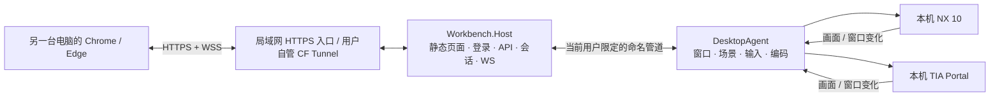

# UG / 博图浏览器远程操作系统：技术架构与 Codex 自动化编程任务规划书

> **当前执行入口：** [本机任务计划 LOCAL-1](./LOCAL_IMPLEMENTATION_PLAN.md) 定义 LC-01～07、原 A/P 验收的本机映射和路线变更门槛；[开发交接](./DEVELOPMENT_HANDOFF.md) 定义换电脑恢复步骤。与旧文中异机/CF专属要求冲突时，以用户范围变更及 LOCAL-1 映射为准；其余安全、真实性和完成条件保留。

> **范围变更（用户确认，2026-09-04）：本版仅要求同一台电脑通过浏览器控制真实 NX / TIA。第二台客户端、LAN 访问、公网/CF 及代理兼容不再是本版交付门槛，旧文中对应远程专属要求由本条覆盖，不能计为 PASS。真实建模/工程操作、菜单/弹窗/中文/保存、单应用与双应用布局、输入安全、恢复、诊断、8 小时耐久、打包及回滚要求继续有效。本机双屏是当前实验实现条件，不代表用户新确认了双显示器产品限制。主技术路线尚未变更；详见 PROJECT_STATUS.md 最新范围记录。**

版本：1.2（关联窗口与帧版本契约补充）· 设计日期：2026-09-03 · 状态：设计复核完成；已有环境准备和局部探针证据，正式功能尚未验收

项目根目录：`C:/Users/happy/Documents/ChatGPT/UG浏览器项目`

本书是后续目标模式实施的主依据。配套文件为 [实现契约与任务依赖](./IMPLEMENTATION_CONTRACTS.md)、[验收标准](./ACCEPTANCE.md)、[目标启动文本](./GOAL_PROMPT.md)、[实施状态](./PROJECT_STATUS.md) 和 [环境与资料依据](./REFERENCES.md)。文中技术方案是工程决策；标为“待实测”的内容不是已经实现的能力。

### 先读这一页

- 产品是“应用级浏览器远控工作台”：真实 UG/博图在被控电脑运行，浏览器负责画面显示和交互；不做模型格式转换或网页 CAD 编辑器。
- 主线为 React/TypeScript → HTTPS/WSS → .NET Host → 用户会话 DesktopAgent → 原生应用；画面优先 WGC + H.264，输入走独立通道。
- 原 Demo 保留为参考，不继续把屏幕矩形 JPEG 循环当作正式媒体引擎。已有探针也必须经过构建和真实应用测试才能复用。
- 最先验证 NX OpenGL 画面、原生菜单/弹窗、完整键鼠、硬编和双窗口切换。主线不可用时先记录证据，再调整路线，不先铺满 UI。
- 一版必须能打开、编辑、保存并重开真实 NX/TIA 工程；必须有异机、断线、输入释放及 8 小时证据。演示窗口通过不等于工程软件通过。
- 两项外部门槛尚未确认：博图组件与当前 Home 25H2 的兼容性；用户 CF 公网路线对持续画面流的使用条件。它们不阻止本地通用功能设计与实现。

阅读顺序：本书第 1–10 节理解边界和架构 → 第 12–15 节理解工作与完成条件 → 实现契约对照协议、依赖及异常流程 → 验收标准执行测试 → 状态文件续接。

## 1. 项目目标与范围

交付一个可持续用于实际工作的浏览器远程操作系统。用户在另一台电脑的浏览器中访问地址，看到被控 Windows 电脑上的真实 UG / NX、TIA Portal 画面，并用鼠标和键盘操作原生软件。模型、工程、计算和保存都发生在被控电脑。

实现用户 PPT 的实际第 5、6、7 页。PPT 内部章节号为 04、05、06，以本次对话中用户的补充和修正为最终需求依据。无需把 CAD 模型转换为网页三维模型，也无需重新实现 UG 或博图的编辑器。

### 1.1 已确认需求

| 编号 | 第一版需求 | 来源与解释 |
| --- | --- | --- |
| R01 | 从另一台电脑的浏览器访问和操控 | 用户明确要求类似向日葵的操作体验 |
| R02 | 一台被控 Windows 电脑，单人使用、单个控制会话 | 不做多用户隔离工作站 |
| R03 | UG 和博图均可单独或同时打开 | 同时打开时，网页左右等宽；仅一款时占满工作区 |
| R04 | UG 默认显示绘图区，允许切换完整界面 | 用户已同意此交互方式 |
| R05 | UG 保留隐藏、缩放、旋转、平移、视角复位 | 这些是核心能力，不是操作白名单 |
| R06 | UG 仍可建模、编辑，使用右键菜单和快捷键 | 用户明确修正 PPT 中“功能受控”的含义 |
| R07 | 博图显示完整原生操作界面 | 第一版覆盖工程打开、编辑、编译、保存的实际工作流程 |
| R08 | 使用软件原生“打开”对话框选择被控电脑本地文件 | 不新增上传平台、云盘、工程管理后台 |
| R09 | 启动、接入已有进程、正常关闭、正常重启和状态监测 | 正常关闭包含原生保存提示，禁止把关闭等同于强杀 |
| R10 | 菜单、文件框、编辑弹窗、错误提示可见且可操作 | 不以“主窗口能显示”作为完整接入的判断 |
| R11 | 断线提示、重连、恢复已有软件会话 | 保留已打开软件和未保存内容，不自动重放编辑命令 |
| R12 | 公网入口由用户配置 Cloudflare 内网穿透 | 系统交付同源 HTTP/WebSocket 服务和部署说明 |
| R13 | 持续用于真实工作 | 包含性能验证、长时间运行、故障恢复和可更新交付 |
| R14 | 锁屏、Windows 登录界面和登录前连接暂不实现 | 以用户已登录、未锁屏、系统未休眠为工作前提 |
| R15 | NX 优先适配本机 10.0.0.24；博图按最新已发布稳定版规划 | 本次核实的博图版本基线为 V21，开工时复核并锁定具体更新版本 |

### 1.2 本版设计假设

这些是为推进设计采用的默认值，并非用户另行确认过的需求。

- 先交付独立 Web 控制台；通过可配置路径前缀和版本化 API 预留未来集成，不实现未提供的宿主平台、单点登录或跨站 iframe。
- 客户端优先支持桌面版 Chrome、Edge 的当前稳定版；不把手机触控、Safari、Firefox 和 IE 纳入第一版正式验收。
- 被控电脑远程使用期间主要供该会话使用；本地鼠标、焦点、窗口位置会同步变化。单人远程不等于创建一套与本地桌面隔离的系统。
- 第一版使用现有物理显示环境，不新增虚拟显示驱动，不保证拔掉显示器、系统休眠或锁屏时仍能工作。
- 每款软件接入一个实例。发现多个可接入实例时让用户选择，不通过标题字符串随意选第一个。
- 第一版保留原生文件权限和工程操作能力。浏览器侧限制的是系统管理接口，不宣称把原生软件变成文件系统沙箱。

### 1.3 明确不做

不做整个数字孪生平台的其他 PPT 页面；不做多人并发、用户组织体系、收费订阅、云工程库、跨电脑文件传输、音视频通话、手机手势、远程开机、无人值守登录、UAC 安全桌面操作和通用多主机管理。

不开发 PLC 通信代理或设备网络穿透。博图与 PLC / 仿真器的通信仍由被控电脑上的原生博图负责。自动验收以离线工程或已配置的仿真器进行，不自动向真实设备下载程序或切换运行状态。

## 2. 现有基础与工程判断

### 2.1 Demo 已实现的代码基础

根目录 `server.py`、`index.html`、`README.md` 已完整静态检查；尚未用此 Demo 运行 NX 或博图实测。

| 项目 | 当前实现 | 实施含义 |
| --- | --- | --- |
| 后端 | Python、websockets、mss、Pillow、pywin32 | 已搭起基本采集与输入转发链路 |
| 目标窗口 | 标题中包含 `Notepad++` 的第一个可见窗口 | 需要替换为按进程与窗口关系管理 |
| 网络 | 前后端均写死 `localhost:8766` | 不能直接用于异机浏览器；README 仍写 8765 |
| 采集 | 按屏幕矩形截图，逐帧 JPEG | 窗口遮挡会进入画面；截图与编码占用同一事件循环 |
| 刷新 | 目标 15 FPS、JPEG 质量 60 | 不是实测达到 15 FPS；计算耗时会进一步降低帧率 |
| 输入 | 左键、拖拽、部分键盘事件 | 右键、中键、滚轮、中文和完整键位尚未处理 |
| 恢复 | 前端两秒后重新建立 WebSocket | 无输入释放、控制归属、画面代次和进程恢复 |
| 工程能力 | 单画布、无鉴权、无窗口管理、无正式验收 | 不能以更换窗口标题作为交付方案 |

原 Demo 作为可回看的验证样本保留。当前 `legacy/demo-v3/` 已有副本，本次复核三个文件的哈希均与根目录一致；本轮未改动原文件。原生探针已有三组不同层次的证据：真实 NX 首帧/显示拓扑/编码器激活；实际 H.264 编码及本机浏览器十分钟动态测试图；真实 NX → WGC/D3D → H.264 → 本机浏览器短时显示。分别见 [M1 初始实测记录](./M1_INITIAL_EVIDENCE.md)、[媒体实测记录](./M1_MEDIA_EVIDENCE.md) 和 [真实源实测记录](./M1_WGC_GPU_EVIDENCE.md)。第三组同时暴露 NX 文件菜单未进入主窗口流的缺口；单独菜单采集成功不等于合成或输入已实现。没有一组证明完整建模、博图或异机验收通过；报告对应其记录的构建，不自动证明后续源码。本次设计交付只读核对已有证据，不把旧测试写成本轮新执行。

### 2.2 已知环境与待验证条件

本机是 Windows 11 家庭版中文版 25H2，系统版本 10.0.26200.9168；i9-13900H、约 32 GB 内存、Intel Iris Xe Graphics。已有原生报告记录两个显示输出：主屏 2560 × 1440 / 120 DPI，第二屏 1920 × 1080 / 96 DPI；NX 窗口当时仍报告 120 DPI，不能把显示器 DPI 与旧应用坐标简单等同。安装了 NX 10.0.0.24，实际程序位于 `D:/Program Files/Siemens/NX 10.0/UGII/ugraf.exe`。这是报告时刻的环境快照，实施前重新枚举，不硬编码屏幕位置或窗口句柄。

设备信息还列出向日葵相关虚拟显示设备，不能据此推断它可供本项目使用。除系统既有 .NET 9 外，项目 `.tools` 内已存在 .NET SDK 10.0.400、Node 24.20.0，本次版本命令核对成功；这不等于完整工程已构建或通过测试。

需把以下问题当成实施门槛，而不是用假设跳过：

1. NX 10 在当前 Windows、显卡驱动上的实际启动、建模、窗口采集和授权状态。
2. 最新探针已有 Intel H.264 / 本机浏览器十分钟测试图证据，以及 WGC/D3D 真实 NX 窗口短时显示证据；仍须验证完整场景、真实视图运动、输入、1080p、双路与正式恢复。详见 [媒体实测记录](./M1_MEDIA_EVIDENCE.md) 和 [真实源实测记录](./M1_WGC_GPU_EVIDENCE.md)。核显型号、候选数量和激活成功不能替代这些证据，也不能据此判断存在两个独立硬编设备。
3. 博图实际安装、授权、工程版本、组件和系统支持。官方 V21 安装要求列出的 Windows 11 Home 24H2 有“仅适用于基础版”的限制；当前主机是 Home 25H2，不能直接判为已匹配 Professional 工程环境。[西门子安装条件](https://www.ad.siemens.com.cn/download/materialaggregation_3824.html)
4. 浏览器 HTTPS、安全上下文和 H.264 解码支持；远端网络的实际往返时延、吞吐量。
5. 正式验收样本。先用临时测试模型 / 工程完成基本工作流，再使用用户典型工程副本测量，不覆盖原工程。

若博图需要不同 Windows 版本或授权，先完成不受其影响的工作并清楚记录依赖；不得自动升级 Windows、卸载 NX 或替换用户的软件许可证。

## 3. 推荐技术路线及取舍

采用 React + TypeScript 浏览器控制台，以及 C# / .NET 10 的 Windows 本地接入程序。优先 Windows Graphics Capture 采集、Direct3D 处理与 Media Foundation H.264 编码，通过 WebSocket 传给浏览器 WebCodecs 解码。保留独立 JPEG 兼容模式。

| 决策 | 选型 | 选择理由与限制 |
| --- | --- | --- |
| ADR-01 | React + TypeScript + Vite | 界面状态、双面板、解码 Worker 和输入协议可分开维护；构建后作为静态文件发布 |
| ADR-02 | .NET 10 LTS、C#、ASP.NET Core | Windows 原生 API、进程与输入、Web 服务统一在一个运行时；不让 Python 再转发每一帧 |
| ADR-03 | 用户会话内的 Host + DesktopAgent 两个进程 | 网关与原生图形故障隔离；Agent 崩溃后 Host 仍可给出诊断并恢复连接 |
| ADR-04 | WGC 按 HWND 采集为主 | 正式测试前不保证 NX OpenGL、遮挡、菜单和最小化等场景均兼容 |
| ADR-05 | DXGI 桌面采集作为受限兼容后备 | 它采集显示输出，不是“按 HWND 抓取后台窗口”；必须说明遮挡与焦点约束 |
| ADR-06 | H.264 + WSS 为主要传输 | 适配用户自管的 CF HTTP 隧道；优化码率和排队，接受 TCP 在丢包下的队头阻塞限制 |
| ADR-07 | WebCodecs 解码、JPEG 兼容 | 主模式要求受支持浏览器和安全上下文；非 HTTPS 局域网入口不能假设 WebCodecs 可用 |
| ADR-08 | 单账号、单控制租约 | 不引入多人工作站或多租户数据库，但防止多个标签页同时注入输入 |
| ADR-09 | 本地 JSON 配置与 ASP.NET Core Cookie 鉴权 | 第一版数据量小，无需 Redis、消息队列或业务数据库 |

Microsoft 当前将 .NET 10 列为 LTS，支持至 2028 年 11 月。[运行时依据](https://learn.microsoft.com/en-us/dotnet/core/releases-and-support) 图形互操作优先选成熟绑定，例如 Vortice 的 D3D11 / DXGI / Media Foundation 绑定及 Windows SDK 的 WinRT 互操作；具体 NuGet 版本在 M0 锁定，不引用仓库 master 作为可复现依赖。[绑定项目](https://github.com/amerkoleci/Vortice.Windows)

### 3.1 为什么不沿用其他路线作为第一版主线

- Python + JPEG：保留验证价值，但对本项目的图形采集、硬编与原生窗口工作，将大量能力放在 Python 外部仍需原生组件；额外保留一层 Python 网关增加部署和排错成本。
- WebRTC：适合低时延音视频，但正常的 CF HTTP/WebSocket 隧道并不自动承载浏览器 WebRTC 的媒体通道。它需要另行确定 ICE、直连或 TURN 路径。当前先做 WSS；只有真实网络指标持续不达标，才单独评估引入这项部署依赖。
- RDP + 浏览器网关：现有主机是 Home，不能直接作为 Windows 原生 RDP 主机；会话语义也不等同于当前本地控制台。[Microsoft 说明](https://learn.microsoft.com/en-us/windows-server/remote/remote-desktop-services/remotepc/remote-desktop-allow-access)
- VNC / noVNC：适合整桌面接入或后续锁屏能力评估，但不能直接满足应用级单双屏、UG 绘图区切换及预期的 3D 操作流畅度；只有专项实测通过才作为替代路径，不默认增加服务安装。
- NX Open API / TIA Openness：第一版不依赖。它们可以辅助语义命令，但涉及版本、安装和授权，不能替代真实 GUI 的捕获与交互。

### 3.2 允许调整的技术细节

具体包版本、编码器选项、窗口识别特征可根据 M0/M1 的证据调整，记录原因即可。若要改成必须新增公网中继、额外收费组件、升级操作系统、取消双软件或降低正式验收标准，则属于设计变更，先出具证据与影响说明。

## 4. 架构与部署



### 4.1 进程和权限

- `Workbench.Host.exe`：运行 Web 网关、身份验证、控制租约、配置和日志；提供版本化 HTTP/WS 接口。
- `DesktopAgent.exe`：在同一个已登录 Windows 用户会话中运行。拥有窗口识别、采集、编码、坐标映射和输入队列。内部用独立工作线程执行图形和编码任务，不阻塞输入与心跳。
- Host 通过启动令牌和只允许当前用户访问的命名管道连接 Agent。控制/状态与各路已压缩视频分管道，不传 GPU 原始帧给 Web 网关，不暴露 Agent 的公网端口。
- Host 与 Agent 默认都是普通用户权限。Windows `SendInput` 受完整性级别限制；目标软件提权时应显示明确错误，不能假装事件已经生效。[输入 API 依据](https://learn.microsoft.com/en-us/windows/win32/api/winuser/nf-winuser-sendinput)
- 第一版提供手动启动入口和可选“用户登录后启动”。不把图形 Agent 直接塞进 Session 0 服务，不宣称能够控制登录界面。
- Host 看护 Agent 的退出，但不会看见断线就重新启动或强制关闭用户的 NX / 博图。
- Agent 独立监测 Host 管道和控制心跳；Host 崩溃也必须触发输入释放。当前台测试/开发仅验证最小链路时，网关只监听环回地址；M2 鉴权完成前不暴露局域网或 CF 公网入口。
- 反向故障也要覆盖：Host 内设最小 InputSafetyGuard，维护已授权输入的保守按下集合；Agent 退出时先禁止新控制、确认旧 Agent 不再执行输入，再释放可能残留的按键。该模块不能注入新的按下动作。冻结、接管和恢复规则详见实现契约，不把“重启 Agent”当作释放保证。

### 4.2 网络模式

| 模式 | 入口 | 说明 |
| --- | --- | --- |
| 同机开发 | `http://localhost:8080` | 只用于开发；支持情况仍以浏览器能力检测为准 |
| 正式局域网 | `https://主机名:8443` | 使用客户端信任的证书；Kestrel 提供 TLS，防火墙开放范围由部署配置控制 |
| CF 公网 | `https://用户域名` → `http://127.0.0.1:8080` | cloudflared 与 Host 同机时，后端 HTTP 仅绑定环回；由用户设置隧道与域名 |
| 临时 HTTP 局域网诊断 | 用户显式开启的本机地址 | 仅无工程内容的测试夹具健康检查；不开放真实画面、登录或键鼠控制 |

所有前端请求使用同源路径。WebSocket 协议随页面 `https:` / `http:` 选择 `wss:` / `ws:`，支持配置的基础路径，禁止写死 IP、localhost 或远端端口。发布单一静态前端，不要求客户端安装插件。

Cloudflare 官方确认 Tunnel 支持 WebSocket，并说明边缘服务更新及空闲会导致连接关闭，因此重连和心跳是基础功能。[Tunnel FAQ](https://developers.cloudflare.com/cloudflare-one/faq/cloudflare-tunnels-faq/) [WebSocket 行为](https://developers.cloudflare.com/network/websockets/)

**CF 部署前门槛：** 同一 FAQ 另列明公网域名路由承载视频/大文件的服务使用条件。不能从 WebSocket 支持推断“免费且允许无限持续传输远控画面”，也不能把改为 WS/JPEG 当作规避方式。本项目这种交互流的具体适用性由用户结合方案与服务方确认；未确认时标记 E10，先做 LAN 和本地反向代理测试。私网路线可能需要客户端软件，不自动替换用户的纯浏览器公网体验；付费服务也不自动视为低延迟远控的技术替代。[官方流量说明](https://developers.cloudflare.com/cloudflare-one/faq/cloudflare-tunnels-faq/#large-file-and-streaming-traffic-through-tunnel)

## 5. 用户界面与原生软件语义

### 5.1 控制台

轻量顶部工具栏展示连接状态、UG / 博图打开或接入按钮、单双屏切换、画质、全屏、退出控制。工作区尽可能留给真实软件，不添加工程管理卡片、统计看板或任务中心。

```text
┌ 连接状态 | UG | 博图 | 画质 | 浏览器全屏 | 退出控制 ┐
│ UG：绘图区 / 完整界面 │ 博图：完整界面             │
│                       │                           │
│  真实画面与原生交互    │  真实画面与原生交互         │
└───────────────────────┴───────────────────────────┘
```

只有一个应用接入时只显示一个面板；两个应用接入时左右各占 50%。点击某侧即请求激活该侧，显示明确的激活边框。同一个 Windows 会话在任意时刻只有一个活动输入目标。

“打开/接入应用”“最大化网页面板”“关闭原生软件”“退出控制”必须采用不同动作，避免把仅想关网页的用户工程一起关闭。

### 5.2 UG 绘图区与完整界面

- 默认绘图区模式，核心操作仍是直接转发原生鼠标和键盘。
- 提供完整界面切换。完整界面包含菜单、工具栏、资源导航和关联编辑窗口，支持持续建模。
- 裁剪边界优先从 NX 10 的子窗口/UI Automation 信息定位，记录实际窗口类及关系；不能猜测一个像素偏移常量用于所有布局。
- 识别不可靠时提供用户校准矩形并按软件版本、DPI、布局保存。布局变化后重新校验；校准失效显示完整界面，不继续使用错误输入坐标。
- 打开原生编辑弹窗、文件选择框时，临时展开该应用场景以容纳完整对话框；关闭后可回到之前的绘图区视图。绘图区模式绝不裁掉正在等待用户操作的弹窗。
- 工具栏可提供隐藏、缩放、旋转、平移、适应窗口 / 视角复位入口，但具体命令映射必须在本机 NX 验证。前四项也可由原生交互完成；“复位视角”和“适应窗口”分别标明，不用一个未经验证的快捷键冒充全部功能。
- 不向 NX 进程注入代码，不修改安装文件；隐藏和编辑等工程操作由用户执行或在测试工程副本上验收。

### 5.3 博图与文件加载

博图接入完整界面，包括启动页、工程视图、属性区、编辑器、编译信息和本地文件对话框。原生工程打开、保存、另存为按照本机行为执行。

网页按钮若提供“打开工程”，只触发已验证的原生打开动作；文件选择仍是远端 Windows 原生对话框。不用 HTML `input[type=file]` 替代，因为它选择的是访问端电脑的文件。

TIA Portal 版本和更新版本写入本地适配配置。V21 是当前核实的已发布版本，不自动把一个旧工程升级保存为 V21；首次打开不兼容工程，由原生提示和用户决定。

### 5.4 源窗口大小与显示器约束

网页面板是左右等宽，不代表源软件必须被挤成同样的小尺寸。TIA 原生界面有最小尺寸；源窗口以实际支持尺寸渲染，再等比例显示到网页，提供放大该侧及 1:1 查看。

调整浏览器尺寸时防抖处理，先计算源窗口可支持的大小，再更新采集和坐标版本。源窗口尽量放在当前显示范围内，不为追求大分辨率直接创建离屏超大窗口或变更 Windows 全局缩放。

窗口级采集允许分别捕获两个窗口，输入仍必须确保被操作窗口已激活、命中区域可点击。若 WGC 在目标软件上不可用，兼容路径需把被操作窗口置前，并明确显示兼容模式，不能承诺后台无遮挡输入。

## 6. DesktopAgent 的关键模块

| 模块 | 职责 | 必须解决的问题 |
| --- | --- | --- |
| AppRegistry | 安装信息、路径、版本、启动配置 | 允许本地配置；不接受网页传入任意可执行路径 |
| ProcessSupervisor | 启动、接入、退出监测 | PID 与创建时间共同识别，区分本项目启动和用户原有进程 |
| WindowRegistry | 主窗口、owner、子窗口、弹窗关系图 | 不靠固定窗口标题；处理启动器、多进程和句柄重用 |
| SceneManager | 某个应用当前可见、可操作的画面组成 | 绘图区、完整界面、模态窗口、菜单和场景代次 |
| CaptureProvider | WGC 主路径、DXGI 后备 | GPU 重置、尺寸变化、锁屏、采集停止 |
| SceneCompositor | GPU 裁剪、缩放、合成和光标 | 画面节点顺序必须与输入命中规则一致 |
| VideoEncoder | H.264 硬编优先、软件/JPEG 兼容 | 能力协商、关键帧、恢复、队列上限 |
| InputDispatcher | 唯一输入队列和输入状态 | 所有路径都能释放按键；验证租约、场景和前台目标 |
| DesktopStateMonitor | 锁屏、会话断开、显示变化 | 停止注入，清理状态，恢复后重新绑定 |

### 6.1 采集策略和弹窗

WGC 的 `CreateForWindow` 可以以窗口句柄创建采集对象，但这不意味着一个对象会自动包含所有关联顶层弹窗。[Microsoft API](https://learn.microsoft.com/en-us/windows/win32/api/windows.graphics.capture.interop/nf-windows-graphics-capture-interop-igraphicscaptureiteminterop-createforwindow)

应用场景应维护：主窗口、独立顶层对话框、关联菜单/工具提示、源坐标与合成坐标的映射、层级和活动模态窗口。结合进程关系、窗口 owner、前台变化与 WinEvent 事件识别，不能仅凭相同 PID 就认定任意窗口属于当前可操作场景。

优先分别捕获并合成关联窗口。短生命周期菜单或无法按窗口捕获的画面，用显示输出中的已验证目标区域补齐。若补齐仍无法保证操作准确，应转为该应用的可见前台兼容场景并提示原因，不静默展示不完整菜单。

桌面采集会看到实际屏幕上的遮挡物。它与 WGC 是不同能力，不能把“DXGI 按窗口采集且永不受遮挡”写进实现或文档。[Desktop Duplication 说明](https://learn.microsoft.com/en-us/windows/win32/direct3ddxgi/desktop-dup-api)

版本一不自动切换成无限制整桌面遥控来掩盖应用场景失败；如果确需加入整桌面模式，作为明确的后续产品变更评估。屏幕补齐之前必须验证目标区域的窗口归属与遮挡；发现无关窗口或归属不明时遮蔽该区域并暂停输入，不能顺便传出聊天、桌面通知等内容。对文件系统的真正访问权限仍取决于当前 Windows 账号。

### 6.2 图形实现门槛

1. M1 先用真实 NX 绘图区、完整界面、右键菜单和文件对话框验证可捕获性。
2. GPU 帧优先在 D3D11 中裁剪、缩放、转换到编码器可接受格式；不要每帧 CPU 回读、再无条件上传。
3. 用 `MFTEnumEx` 枚举、启动并测量编码器，不仅检查是否存在名字。[硬件编码枚举](https://learn.microsoft.com/en-us/windows/win32/api/mfapi/nf-mfapi-mftenumex)
4. 处理硬件 MFT 的异步事件、D3D 设备管理和输入输出背压。低延迟选项按编码器支持能力设置，不假定所有厂商实现一致。[低延迟属性](https://learn.microsoft.com/en-us/windows/win32/medfound/codecapi-avlowlatencymode)
5. Vortice/WinRT 互操作若存在缺口，先做最小、可测试的 C# 互操作封装；只有有证据表明必要时才新增小型 C++ DLL，不能顺手拆成另一个远程服务。
6. 保证 COM 对象、纹理、帧池、缓冲区和 VideoFrame 生命周期明确；每次布局切换和断线都能释放。

### 6.3 基于现有探针的实施细化

现有 MediaProbe 将 `sceneVersion` 固定为 1，适用于其固定单窗口只读实验，不能原样推广为动态弹窗远控。下一步必须同时解决窗口关联、真实捕获边界、GPU 合成及帧与场景版本绑定；不只把菜单截图叠上去。

具体约定见 [实现契约第 4.4 节](./IMPLEMENTATION_CONTRACTS.md)：每次合成对应不可变几何；版本随输入编码器的原始帧一路保留，不能在异步编码输出时拿“当前场景”回填旧帧；弹窗出现、消失和移位即使主窗口静止也产生更新。几何改变与解码器重建是两个概念，分别管理 sceneVersion 和 epoch。

M1 先验证同进程 owner 关联菜单与模态框，再验证真实文件框、编辑框及辅助进程窗口。这个顺序不削减最终弹窗范围。初期只支持不透明矩形的合成器必须明确标注局限；透明窗、阴影、跨进程和越界场景有专门验证，不得假装支持。

## 7. 通道、画质与协议设计

### 7.1 通道分工

同源服务提供一条控制/状态 WebSocket，每个应用一条独立的视频 WebSocket，HTTP 用于登录、配置、启动/正常关闭和能力查询。这样画面发送拥堵不会在应用自己的同一发送队列里挡住鼠标释放消息；公网底层仍可能共享链路，所以仍要实施总码率和超时管理。

推荐路由如下，`{base}` 可为空：

| 路由 | 用途 |
| --- | --- |
| `{base}/api/v1/auth/*` | 登录、退出、当前身份；密码仅在 HTTPS 或同机初始化时提交 |
| `{base}/api/v1/capabilities` | 软件、采集、编码、屏幕和浏览器协商所需信息 |
| `{base}/api/v1/apps` | UG/博图状态及可接入实例 |
| `{base}/api/v1/apps/{appId}/start` | 通过已登记配置启动 |
| `{base}/api/v1/apps/{appId}/attach` | 接入已运行实例 |
| `{base}/api/v1/apps/{appId}/close` | 请求正常关闭，可能进入等待保存确认状态 |
| `{base}/api/v1/apps/{appId}/restart` | 正常关闭完成后再启动；保存提示未处理则保持等待 |
| `{base}/api/v1/control/acquire`、`release` | 获取、释放单控制租约 |
| `{base}/ws/v1/control` | 输入、激活、场景确认、心跳、状态、画面反馈 |
| `{base}/ws/v1/video/{streamId}` | 单路视频及该路解码配置信息 |
| `{base}/health/live` | 仅返回服务活性，不泄露软件、路径、用户信息 |
| `{base}/api/v1/diagnostics` | 已鉴权的诊断信息，敏感字段过滤 |

`appId` 仅为服务端登记的 `nx`、`tia`；不接受客户端自报 HWND、PID、屏幕绝对坐标或任意命令行作为执行依据。

### 7.2 视频格式

主模式用低延迟 H.264，在支持时关闭引起帧重排的设置，优先测试无 B 帧配置。编码器支持不同选项时，记录实际生效参数。

WebCodecs 以完整 access unit 解码。第一版统一传 Annex B，每次流重建 / IDR 帧带 SPS、PPS；不把 MP4 文件头、AVCC 长度前缀和 Annex B 起始码混用。浏览器先做能力检测再配置解码器。[H.264 WebCodecs 注册说明](https://www.w3.org/TR/webcodecs-avc-codec-registration/)

建议冻结的视频包头 v1 为 40 字节，大端序：magic 4 字节、协议版本 1、codec 1、flags 2、streamId 4、sceneVersion 4、epoch 4、frameSeq 4、时间戳微秒 8、width 2、height 2、payloadLength 4。后接完整视频 access unit 或 JPEG。每个逻辑包与一个 WS 消息对应；接收端仍须处理 WebSocket 分片重组。

包头格式在 M2 生成共享协议定义、跨 C#/TS 固定样本和错误输入测试后冻结。单包上限、合法分辨率、递增序号、关键帧标志全部校验。初始上限建议控制消息 64 KiB、视频消息 8 MiB；实际编码分辨率不得靠放开无限包长解决。

### 7.3 延迟与恢复

- 原始采集队列最多保留 1–2 帧；编码前可丢弃过时原始帧。
- 已编码 H.264 帧有参考依赖，不能像 JPEG 一样任意丢 P 帧后接着解码。过载时重建视频 epoch、发送新的解码配置与 IDR；必要时关闭该视频 WS 清除传输积压。
- 视频 WS 的一个写协程顺序发送。发送超时、已显示帧落后或解码队列积压时降码率/帧率，并按上述方式恢复；不无限缓存。
- 浏览器以最新可显示帧更新画布，在 Worker 解码，及时关闭 `VideoFrame`；前一帧的异步回调不得覆盖新 epoch 的画面。
- 输入通道无可用新画面时停止新的位置相关输入并释放已按下状态，防止操作过时画面。
- 流的 `epoch`、`sceneVersion`、解码配置、实际显示帧确认共同决定是否允许恢复操作。
- 静止画面没有新帧并不自动等于断流。每路视频保持独立存活信号，结合采集状态、场景版本、发送/显示确认判断；发现真实故障才停输入。只在控制连接上收到心跳，不足以证明两路视频均正常。详见实现契约的静止/断流判定。

### 7.4 初始质量档位

下列是待 M1/M5 实测调优的起始配置，不是已经达到的性能。

| 档位 | 建议参数 | 场景 |
| --- | --- | --- |
| 标准 | 单路最高 1920×1080、30 FPS、4–8 Mbps | 常规建模与编辑 |
| 清晰 | 最高 2560×1440、20–30 FPS、8–16 Mbps | 小字、密集线路和细线；受源屏幕与编码能力约束 |
| 弱网 | 最长边 1280、15 FPS、1–3 Mbps | 应急远程操作；清晰度降低要明确可见 |
| JPEG 兼容 | 质量/帧率自适应，初始 8–15 FPS | 能力不支持或排错；不是 3D 正式性能达标的替代证明 |

双路采用总预算，初始 12 Mbps；有输入的一侧优先，另一侧有变化时保持更新、无变化时降低刷新。不能简单地让两路各自抢满预算。

H.264 的色度采样可能影响细彩色线和小字，必须在真实 TIA/NX 画面验证。优先保持源像素清晰、提供 1:1 查看和提高质量，不以“视频分辨率数字足够高”代替可读性验收。

WebCodecs 要求安全上下文。局域网使用普通 HTTP 时，界面应说明如何启用 HTTPS，不发送真实工程画面或接收远控登录；JPEG 是解码兼容路径，不是取消加密的理由。不能通过关闭浏览器安全限制使测试通过。[WebCodecs 规范](https://www.w3.org/TR/webcodecs/#videodecoder-interface)

## 8. 输入完整性与坐标模型

### 8.1 唯一输入状态机

输入消息包括协议版本、租约、appId、sceneVersion、streamEpoch、最近显示帧编号、递增 inputSeq、事件种类和具体键/按钮。服务端验证控制权、媒体代次与场景后执行。精确定义见实现契约。

支持鼠标左、右、中键、双击、悬停、拖拽、滚轮及常用修饰组合；支持键盘字母数字、功能键、方向键、编辑键、数字键盘和左右修饰键。前端优先以 `KeyboardEvent.code` 表达物理键，文本输入单独处理，不能继续通过单个字符猜测全部键位。

使用 Pointer Capture 获取画布外拖拽的抬键事件。在 pointercancel、lostpointercapture、页面失焦、隐藏、租约撤销、连接中断、退出控制或目标进程退出时释放已注入的鼠标和键盘状态。

服务端同时维护 pressedKeys/pressedButtons 和看门狗。输入连接心跳初始 2 秒，连续 6 秒未收到有效心跳即释放全部输入并撤销租约；不能只依赖浏览器发“释放”事件。网络恢复不重放断线前的点击、快捷键或文本。

### 8.2 坐标与焦点

坐标链为“浏览器实际画面矩形 → 归一化坐标 → 合成场景像素 → 对应窗口/裁剪源像素 → Windows 虚拟桌面物理像素”。要扣除留黑边、CSS 缩放，区分设备像素比、DPI 和源分辨率；负坐标、多显示器边界不可用 unsigned 随意截断。

服务端启用 Per-Monitor DPI Aware V2，并由同一份 SceneGeometry 同时驱动合成和输入映射。输入位置越界或场景版本不匹配时拒绝；旧场景的释放消息仍要用于安全释放状态。

输入前确认当前原生目标已被激活且命中目标正确；激活失败时不继续全局注入。如果目标有模态窗口，应将输入路由到其实际画面节点，不能强行切回被禁用的主窗口。

布局切换采取“释放输入 → 更新窗口/采集 → 发布新场景 → 解码新帧 → 客户端确认已显示 → 恢复输入”的事务顺序。不要先缩放画布、继续沿用旧坐标。

拖拽时固定输入目标；跨到另一网页面板不能把后续 move/up 发送给另一软件。先结束/取消拖拽，再显式切换目标。全局输入有检查与注入之间的竞争窗口，第一版不宣称提供桌面安全隔离；本地用户可随时停止控制，焦点被无关窗口夺走则暂停，禁止持续争抢焦点。

### 8.3 中文、快捷键与剪贴板

支持客户端通过文本输入框/隐藏输入控件完成中文组合输入，使用 `compositionend` 或明确的提交事件发送已提交文本，服务端以经过验证的 Unicode 输入注入。不能同时发送组合输入期间的物理字符造成重复。

保留直接远程键盘输入路径并在 NX/TIA 文本框实测。若某个控件不支持 Unicode 注入，可提供用户主动点击的“发送文本”兼容动作；只有明确需要粘贴时才触碰系统剪贴板，并避免覆盖期间用户新复制的内容。第一版不持续同步两端剪贴板。

浏览器和操作系统可能优先处理部分组合键。常见工程快捷键必须实测，无法直接截获的提供明确的远端快捷键按钮；不能保证网页夺取所有系统快捷键。`Ctrl+Alt+Del`、登录和 UAC 桌面仍不在本版范围。

## 9. 应用生命周期与会话恢复

### 9.1 软件状态

`NOT_INSTALLED → STOPPED → STARTING → READY` 为基本状态；同时包括 `NEEDS_USER_ACTION`、`CLOSING`、`EXITED`、`ERROR`。等待许可证、工程转换、保存提示或首次运行向导，都应进入可解释的等待状态。

启动参数来自本地受控配置。NX 优先使用已验证的官方快捷方式/启动环境，不能仅因为找到了 ugraf.exe 就认定绕过原启动器也可工作。接入已有实例必须校验进程路径与版本。

启动请求设为幂等。同一软件启动中重复点击，不重复创建实例。NX 和 TIA 的初始启动超时分别可设为 180 秒与 300 秒，可配置且显示进展；实际等待时间不能与视频首帧指标混为一谈。

“关闭”发送正常关闭请求。出现保存对话框则保留可操作画面；只有进程实际退出后才从布局移除。“重启”仅在正常关闭完成后继续。强制结束如果未来提供，必须是单独操作，不用于断线恢复或服务停止的默认路径。

### 9.2 三层状态分开

- 连接状态：连接中、已连接、重连中、认证失效、离线。
- 控制状态：未持有、已持有、已撤销；新标签页不能无提示接管旧标签页。
- 应用/媒体状态：软件未安装/运行/等待操作，以及流初始化/可用/降级/故障。

网页断开后释放控制和视频资源，默认保留软件进程。PPT 的“超时释放”在本版解释为释放连接、采集和控制资源，不自动丢弃未保存工程。

重连顺序：重新认证和获取控制权 → 同步应用快照 → 恢复视图偏好 → 建立视频 → 收到当前场景首个可显示帧 → 启用输入。重连退避初始 0.5、1、2、4 秒，上限 5 秒并加抖动。

Host/Agent 重启后重新枚举仍存活的原生进程；不从持久化文件盲信旧 HWND。持久化只保存配置、视图偏好和候选实例信息，不保存未执行输入队列。

检测到 Windows 锁屏、休眠或会话切换时，显示明确状态、释放输入、暂停采集；用户在本机解锁/恢复后可重新绑定。此处的恢复不构成“可操作锁屏”的实现。

## 10. 最小可用安全与本地管理

虽然只有一个用户，远程键鼠接口仍需独立鉴权。

- 第一次本机启动时设置单账号密码，采用成熟的 ASP.NET Core 密码哈希实现；不在源码中固定密码。
- 同源 HttpOnly 会话 Cookie，HTTPS 下 Secure，第一版 SameSite=Strict。所有控制、视频、状态接口验证身份与会话，退出立即撤销对应控制租约。
- 已建立的 WebSocket 也需检查身份有效期和撤销状态，不能只在握手时验证 Cookie；退出/过期时停止视频、撤销控制并释放输入。
- HTTP 状态变更接口验证防伪令牌；WS 握手验证 Origin、Host、身份。控制 WS 可先进入无租约状态，申请租约后才允许输入；视频 WS 额外验证租约。具体连接顺序见实现契约。限制请求体、字符串长度、频率和枚举值。
- HTTP API 不提供任意命令、PowerShell、任意文件读取、任意 HWND 操作能力。可执行路径和启动参数仅从被控端本地配置读取。
- CF Access 可作为用户额外的一层保护；未实现并验证其 JWT 验签前，不直接相信来访请求中的身份头。
- Forwarded Headers 只信任明确配置的反向代理来源，不能让任意客户端伪造协议或源地址。
- 当前用户专属配置/密钥目录，ASP.NET Core Data Protection 密钥使用 Windows 可用的保护机制并持久化。日志默认不记录密码、键盘文本、文件内容或完整工程路径。
- 静态资源不包含密钥；不把项目工作目录作为任意静态文件目录，根目录安装包和工程源文件不能从 Web 下载。
- 提供本机“停止远程控制”入口、状态标记和干净退出；不采用隐藏常驻、偷偷启用远控或不明权限提升。

正常使用原生 UG/博图意味着用户可以按 Windows 账号权限打开和保存文件。仅隐藏菜单或裁剪画面不构成权限隔离，本版不得宣传“限制在某个工程目录内”的强隔离能力。

## 11. 目标项目结构

以下是目标结构；当前仅部分目录和探针存在，本轮只更新设计文档，不按目录存在判定实施完成。

```text
UG浏览器项目/
  docs/
    CODEX_AUTOMATION_PLAN.md
    IMPLEMENTATION_CONTRACTS.md
    ACCEPTANCE.md
    GOAL_PROMPT.md
    PROJECT_STATUS.md
    REFERENCES.md
    decisions/                 # 实施中经过证据支持的设计调整
  legacy/demo-v3/               # 原 Demo 的已核验副本
  src/
    Workbench.Host/             # ASP.NET Core、鉴权、API、WS、Agent 看护
    Workbench.DesktopAgent/     # 用户会话内的窗口、输入与图形工作进程
    Workbench.Contracts/        # 协议类型、状态、共享错误码
    Workbench.Windows/         # Win32、WGC、D3D、编码互操作封装
    web/                       # React、TypeScript、解码 Worker
  tests/
    Contracts.Tests/
    DesktopAgent.Tests/
    DesktopFixture/            # 测试窗口、弹窗、键鼠事件可视化
    web-e2e/
  config/
    host.example.json
    applications.example.json
  scripts/
    doctor.ps1
    dev.ps1
    verify.ps1
    package.ps1
  artifacts/verification/      # 测试日志、短录屏、性能记录，不默认提交大文件
  dist/                       # 发布产物，不提交
```

前端至少分出应用状态、工作区布局、视频渲染、输入、连接恢复、原生弹窗场景、登录和诊断模块。协议定义具有单一来源并生成 TypeScript 类型，不能手写两套长期漂移的枚举。

应用配置与运行日志存入 Windows 当前用户的数据目录，使用系统 API 获取路径。路径包含中文和空格必须正常工作，不要求用户把本项目搬到英文根目录。

## 12. 实施顺序与任务拆分

按 M0 → M1 → M2 → M3 → M4 → M5 → M6 → M7 → M8 的主顺序推进。具体任务依赖和验收映射见 [实现契约第 8 节](./IMPLEMENTATION_CONTRACTS.md)。这不是全阶段强串行：可提前编写独立测试、打包脚本和文档；M1 的真实 NX 技术门槛未过，不把完整 UI 和正式服务作为主投入。博图尚未就绪时将相关任务细分 common/nx/tia 子状态，继续已满足依赖的通用和 NX 工作，不把 TIA 待测状态传播成整个仓库不能工作。

每个任务完成必须写明修改文件、验证方法、结果和下一项；不能只改状态为“完成”。任务卡中的输出目录是未来实施产物，不代表当前已存在。

工作量重点集中于 M1 的图形兼容验证、M3 的输入/焦点、M4 的弹窗场景和 M5 的编码恢复；M0/M2 为中等，M6/M7 为高，M8 为中等。先完成 M1 后才能基于真实限制估算工期，不用代码行数或模型生成速度推算交付日期。

### M0：固定环境与可复现基线

| 任务 | 交付内容 | 完成标准 |
| --- | --- | --- |
| M0-01 | 原 Demo 副本、哈希、忽略规则 | 保留原代码和用户文件；不把 360 安装包、.idea、工程或私钥提交进 Git |
| M0-02 | `doctor.ps1`、环境报告 | 输出 OS、DPI、显示器、GPU、SDK、软件版本和启动方式；不输出许可密钥 |
| M0-03 | SDK/依赖版本锁定 | 准备 .NET 10、前端 Node LTS 与包锁；官方依赖来源；发布不依赖开发环境 |
| M0-04 | NX / TIA 环境清单与测试样本清单 | NX 实际运行检查；TIA 版本、组件、系统要求、授权分别记录，未具备项明确待办 |

输出：环境报告、`docs/decisions/000-baseline.md`、样本清单。门槛：具备 NX 实测路径；TIA 缺失不伪装为通过。

### M1：原生采集、输入、编码可行性验证

| 任务 | 交付内容 | 完成标准 |
| --- | --- | --- |
| M1-01 | 最小 WGC / DXGI 采集探针 | NX 模型、完整界面、遮挡、右键、打开文件、编辑弹窗逐项短录屏 |
| M1-02 | 键鼠与坐标探针 | 中键/滚轮/右键、修饰键、中文、DPI 坐标和主动释放在测试窗口及 NX 实测 |
| M1-03 | H.264 硬编 → WS → WebCodecs 最小链路 | 可连续运行 10 分钟，记录实际编码器、首帧、帧率、CPU/内存及重连；JPEG 对照可用 |
| M1-04 | 双窗口和弹窗场景验证 | NX + 测试窗口并行；TIA 可用则加入，验证抓取与输入目标不会混淆 |

输出：可运行的最小验证工程、结果表、风险复核。门槛：正常 NX 工作画面可见可控，明确可用的采集/编码路径。若主路径失败，比较有证据的后备方案并记录具体失败条件；不以静态截图或录播冒充实时控制。

### M2：项目骨架、鉴权和协议

| 任务 | 交付内容 | 完成标准 |
| --- | --- | --- |
| M2-01 | Host、Agent、Contracts、前端骨架 | 一个开发入口可启动；Agent 退出时 Host 可报告并有界重启 |
| M2-02 | 本机初始化、登录、Cookie、控制租约 | 未登录不能取流/操作；第二标签页不能无提示同时控制 |
| M2-03 | 控制/视频协议与错误码 | C#/TS 固定样本互通；异常包、越界值、过期租约被拒绝 |
| M2-04 | 同源和代理兼容入口 | HTTPS/WSS、路径前缀和反向代理可测试；不硬编码 localhost |

输出：协议文档、类型、接口契约测试。门槛：能在测试窗口上完成已鉴权的跨浏览器页面操作。

### M3：应用管理和完整输入

| 任务 | 交付内容 | 完成标准 |
| --- | --- | --- |
| M3-01 | 安装检测、启动和已有实例接入 | 本地可配置 NX/TIA 路径；启动幂等；多实例有明确选择 |
| M3-02 | 进程/窗口图与正常关闭重启 | 保存提示不被跳过；确认退出后才更新布局或重启 |
| M3-03 | 完整 Pointer/Keyboard 输入链 | 左右中键、双击、拖拽、滚轮、键位、中文与失焦释放可测 |
| M3-04 | 活动目标、命中和版本验证 | 坐标映射准确；过期场景拒绝输入；原生激活失败可解释 |

输出：NX 适配、TIA 通用适配和窗口测试夹具。门槛：完成 NX 本地文件打开、基础编辑、保存副本的连贯流程。

### M4：双应用布局、UG 裁剪与弹窗

| 任务 | 交付内容 | 完成标准 |
| --- | --- | --- |
| M4-01 | 软件选择、单屏/双屏和应用放大 | 自动左右等宽，关闭后另一侧满屏，无整页刷新 |
| M4-02 | NX 绘图区定位、校准和完整界面切换 | DPI/布局变化不导致错点；校准失败可恢复完整界面 |
| M4-03 | 菜单和关联窗口合成、模态输入路由 | 打开/保存、右键子菜单、编辑参数框不缺失且可操作 |
| M4-04 | 场景切换事务与辅助操作 | 首帧确认后才恢复输入；UG 核心操作和原生快捷键均可用 |

输出：可真实操作的双应用工作区、主要场景截图/短录屏。门槛：真实 NX；TIA 可用时必须跑完整工程操作。测试窗口只可替代通用机制验收，不替代 TIA 真机验收。

### M5：正式媒体管线与性能

| 任务 | 交付内容 | 完成标准 |
| --- | --- | --- |
| M5-01 | 原生帧处理与硬编、软件/JPEG 后备 | 实际编码器和降级原因可查，设备重置不永久黑屏 |
| M5-02 | 解码 Worker、队列、epoch/IDR 恢复 | 高负载不无限积压，不出现旧帧覆盖或参考帧断裂后持续花屏 |
| M5-03 | 总码率、活动侧优先和质量档位 | 双路符合总预算，非活动侧必要变化仍及时可见 |
| M5-04 | 延迟、清晰度、资源评测 | 按 ACCEPTANCE.md 报告实测，不把 ping 值标成操作时延 |

输出：性能数据与配置建议。门槛：达到已定义的 LAN 基准；CF 网络结果单独标识，不保证任意网络达到同一时延。

### M6：会话恢复与异常处理

| 任务 | 交付内容 | 完成标准 |
| --- | --- | --- |
| M6-01 | 重连、心跳与控制权回收 | 断线后无按键卡住，不重复原生编辑操作 |
| M6-02 | 软件等待、异常退出和权限错误 | 每类错误有明确状态、恢复入口和日志关联 ID |
| M6-03 | Agent 崩溃、显示变化、锁屏/解锁处理 | 应用进程保留；本机解锁后重新绑定；不尝试控制安全桌面 |
| M6-04 | 清理、持久化、重复开关测试 | 多次连接/切换后无持续句柄、纹理、内存泄漏趋势 |

输出：故障注入结果和恢复操作说明。门槛：故障演练与工作文件保护全部通过。

### M7：真实应用工作流验收

| 任务 | 交付内容 | 完成标准 |
| --- | --- | --- |
| M7-01 | NX 连贯建模验收 | 打开模型副本、核心视图操作、创建/修改特征、保存/重开核对 |
| M7-02 | TIA 连贯工程验收 | 本地工程打开、编辑、编译、保存/重开，必要原生弹窗正常 |
| M7-03 | 双软件连续使用与 8 小时运行 | 2 小时间歇实际操作 + 6 小时混合活动，记录时延、资源和错误 |
| M7-04 | 本机浏览器接入复核（LOCAL-1） | 在同机真实环境验证访问/会话/解码/输入恢复；原第二台客户端与CF子要求 SUPERSEDED_BY_USER_SCOPE |

输出：逐项验收表、实际软件/工程版本和证据位置。门槛：必需真实测试不能被 mock、截图或自动化脚本返回码代替。

### M8：打包、部署、更新与交付

| 任务 | 交付内容 | 完成标准 |
| --- | --- | --- |
| M8-01 | Windows x64 自包含发布包 | 包含 Host、Agent、前端，不要求用户装 Python、Node 或开发版 .NET |
| M8-02 | `doctor.ps1`、启动/停止、本机访问与诊断说明 | 干净目录可部署；数据与程序分离；loopback范围；LAN/CF说明不再是本版要求 |
| M8-03 | 升级/回滚与故障排查说明 | 保留上一可用版本，升级不覆盖本地配置，不关闭用户工程 |
| M8-04 | 最终报告和未完成项清单 | 发布包哈希、版本、验证结果完整；任何待验收项不写成通过 |

输出：`dist/` 发布包、运行手册、交付报告。门槛：满足本书第 15 节的完成定义。

## 13. 自动化验证方式

测试只覆盖实际风险，不追求无意义的数量或覆盖率。使用 xUnit 进行协议/状态/坐标测试，Playwright 验证网页交互，Windows 测试夹具验证输入和窗口，真实 NX/TIA 验证不可替代的兼容性。

必须区分三种证据：自动化逻辑测试、真实 Windows 输入/图形测试、真实业务软件工作流。不能把 CI 中测试窗口的成功换成“博图已支持”。

实施后提供统一命令，建议语义为：

```powershell
.\scripts\verify.ps1 -Suite Contracts
.\scripts\verify.ps1 -Suite Web
.\scripts\verify.ps1 -Suite Desktop
.\scripts\verify.ps1 -Suite Nx
.\scripts\verify.ps1 -Suite Tia
.\scripts\verify.ps1 -Suite Soak -Hours 8
.\scripts\package.ps1
```

这些命令目前尚未实现。包含真实键鼠操作的套件运行前要明确提示将占用桌面，并在专门的测试会话/工程副本中执行。若当时可用工具不能操作原生桌面，可以交付测试夹具、诊断程序和可执行测试步骤，由用户提供真实操作证据；不能声称工具做了它无法做的事。

Windows 原生自动化失败时，先判断授权、前台、桌面会话和工具能力，不反复盲点或改用户文件来凑结果。

详细项目、目标阈值、样本和报告字段见 [ACCEPTANCE.md](./ACCEPTANCE.md)。

## 14. Codex 目标模式执行约定

本阶段交付设计复核。用户后续明确要求实施时，先核对已有目标和状态，从最近未完成任务继续；已有目标不重复创建，也不重做已有基线。官方文档使用 `/goal`；中文界面的名称以实际入口为准。[OpenAI 官方说明](https://learn.chatgpt.com/zh-Hans/use-cases/follow-goals)

执行时先读本书、实现契约、验收标准和实施状态，再检查当前工作树。不要重新采访已经确认的需求；本书中的实现默认值可直接采用。未明确的低风险实现细节自行选择并记录。

每个实施循环执行：检查上个证据 → 选择最近依赖已满足的任务 → 实现一个连贯增量 → 验证具体风险 → 更新 `PROJECT_STATUS.md` → 继续下一任务。不得每做完一个小功能就结束目标，也不得用同一失败方式无限重试。

暂缺博图、许可证、兼容系统、第二台客户端或 CF 域名时，继续完成独立可做的任务；用 WAITING_EXTERNAL 标记受影响项目。已经穷尽相关工作而确需外部条件时，列出精确阻塞、已验证产物和恢复步骤，遵循目标工具的状态规则处理，不把整项目标标记为已完成。

避免自动购买软件、改变操作系统版本、替换许可证、修改 CF 账号配置、向真实 PLC 写入、强制关闭用户工程。常规本地代码、依赖准备、隔离测试和发布包构建按后续实施授权推进；需要额外系统变更时给出具体影响。

没有用户明确要求时，不自行启用多智能体。任务划分本身不表示创建多个 Codex 任务或自动分派。

不擅自设定 token 预算、虚构完成日期或保证一次无人干预跑通全部外部软件。每阶段记录真实状态，目标可在补齐外部依赖后继续。

### 14.1 当前工作树的实施续接点

这是 2026-09-03 设计交付时的检查点，未来以 PROJECT_STATUS 的最新记录为准，不能机械重跑所有已完成步骤。

实施补记（同日 17:15）：关联窗口实验已有 owner/几何单测、GPU Alpha 校验，以及真实 NX 菜单/文件框同流显示和消失的证据，见 [M1_SCENE_EVIDENCE.md](./M1_SCENE_EVIDENCE.md)。下面的设计交付快照不表示这些增量尚未开始；续接应按 PROJECT_STATUS 的 SC01–SC08 状态补余项。产品输入、编辑参数框、双窗/JPEG 和真实持续运行尚未通过，M1 门槛不变。

- 复用已保留的 Demo、项目本地工具链及历史测试证据；不重复解压或重新下载依赖。
- `WgcNv12Source`、`IProbeFrameSource` 及 `H264Probe` 已接入 CLI/本机媒体页面；真实 NX 短时显示、低延迟属性、解码色彩元数据与取消重连已有证据，临时 API 检查分支已移除。详见真实源实测记录，仍不能将局部媒体通过等同 M1 完成。
- 下一实施检查点是已由实测暴露的 owned 菜单/弹窗合成，随后补颜色数值、尺寸/最小化恢复、资源趋势及真实视图运动；保留原测试图路径作为回归，不能用它替代真实窗口验证。
- 然后补完整键鼠、Windows 夹具、NX 原生菜单与文件/编辑弹窗、双窗口和 JPEG 对照，形成 M1 放行报告。真实操作必须在安全测试时段及工程副本上进行。
- 文档、逻辑测试、真实采集、真实操作、异机和耐久分别记证据。此处没有把 M1 或完整项目标记完成，也不授权改变许可证、操作系统或 PLC 状态。

## 15. 完成定义和交付物

“设计完成”仅表示本套文档已交付。“实施完成”必须同时满足以下条件：

1. 源代码可从锁定依赖构建，Windows 发布包可以在目标机启动。
2. 同一台电脑通过浏览器完成受控访问，真实 NX 和真实 TIA 均可独立及网页左右等宽双栏操作（用户本机范围变更，LOCAL-1）。
3. UG 绘图区/完整界面切换、核心视图操作、建模编辑与本地文件流程均经实测。
4. 博图工程编辑、编译、保存和相关弹窗经过真实工作流验收。
5. 安全、输入准确性、断线恢复、保存保护和本机性能的所有有效必需项通过，原性能上限按 LOCAL-1 映射保留。
6. 完成 8 小时耐久测试，报告包含采样数据、故障和资源变化。
7. 原 CF/公网与异机专属条件已由用户取消，标 SUPERSEDED_BY_USER_SCOPE 并保留历史，不计 PASS，也不再是本版门槛；本机安全与恢复要求不得一并取消。
8. 交付运行手册、兼容清单、部署说明、发布包哈希、回滚方法和最终验收报告。

没有 TIA 或缺少真实测试设备时，可交付标明范围的候选版本，但不满足上述全项目完成定义。不得删除失败验收项、把未执行写为通过，或将“能播放画面”改称“可持续实际工作”。

后续扩展按独立版本处理：锁屏与登录前访问、整桌面模式、WebRTC/TURN、移动端、多主机、多用户隔离、跨电脑文件传输和宿主平台集成。它们不阻塞本版已经明确的功能实现。

### 15.1 本次设计交付检查

- PPT 实际第 5–7 页已逐页读取，与三张截图及用户后续修正一致；PPT 中的“功能受控”不作为禁止建模编辑的授权。
- 原 Demo、已解压项目、既有代码和历史报告保留；本轮只校订规划及资料状态，不扩展业务实现，不新建或完成目标。
- M0–M8 共 36 项任务；依赖、产物和验收对应关系见实现契约。功能/安全验收 A01–A34 与性能/稳定性指标 P01–P13 保留，不能靠减少测试宣告完成。
- 后续实施优先复用已有基线、测试图和真实 WGC/GPU 短时媒体证据，从 M1 尚缺的关联窗口合成、完整输入、真实视图运动/文件框/编辑框与持续测试继续；尚未通过 NX 主线门槛，不提前宣称完整技术路线已经落地。
- 规划书、实现契约、验收标准、目标正文和实施状态共同构成编码输入；不能只把技术栈摘要交给代理后让其自行改变产品边界。

### 15.2 1.2 版设计变更记录

- 触发证据：真实 NX 主流漏文件菜单；菜单单独 WGC/GPU 编码成功；现有最小媒体入口和解码页面使用固定场景版本。
- 调整：补充关联窗口准入、坐标边界、资源所有权、透明合成限制、编码前后的场景版本传递，以及 SC01–SC08 技术验证子检查点。
- 影响：后续 M1 的场景实验和 M4/M5 的正式实现需遵守新契约；40 字节二进制包头、M0–M8 的 36 项任务及全部 A/P 验收编号不变。SC 项是已有任务的子检查，不是另起项目。
- 状态：本次仅修改设计文档；未运行新的原生测试、未改业务源码，也未将任何正式功能标为通过。
